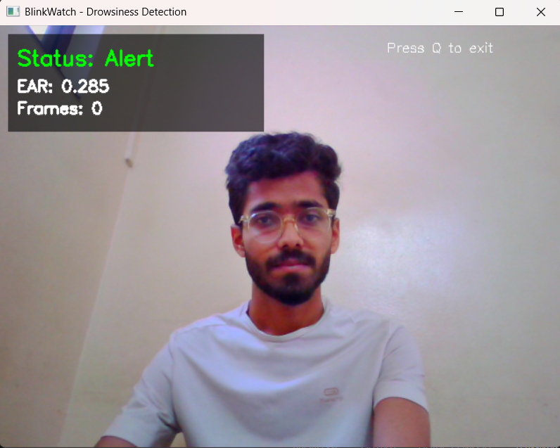
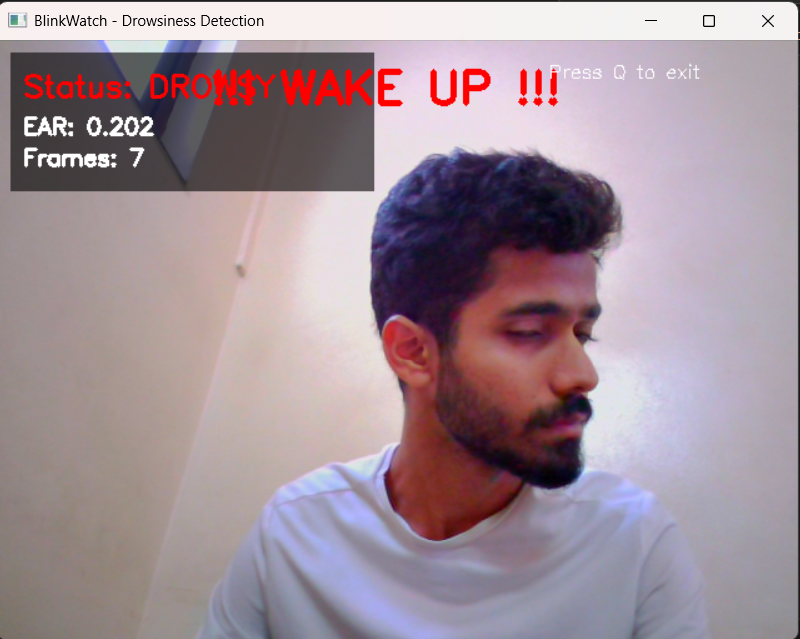
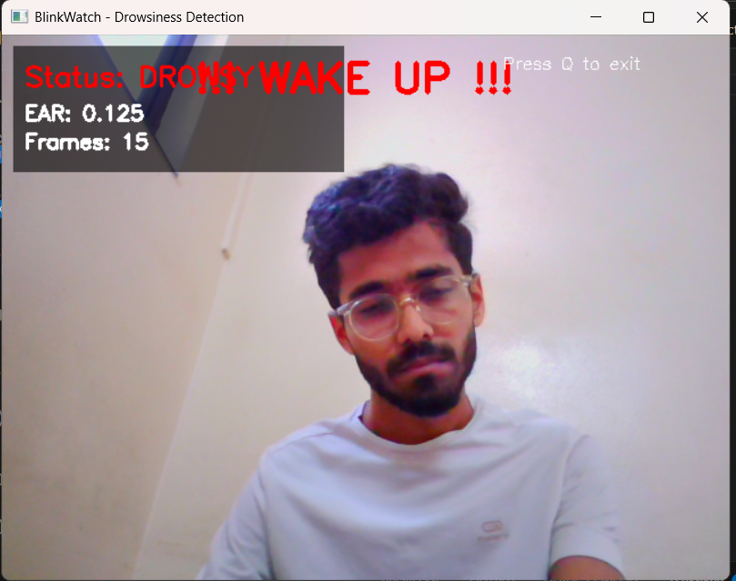
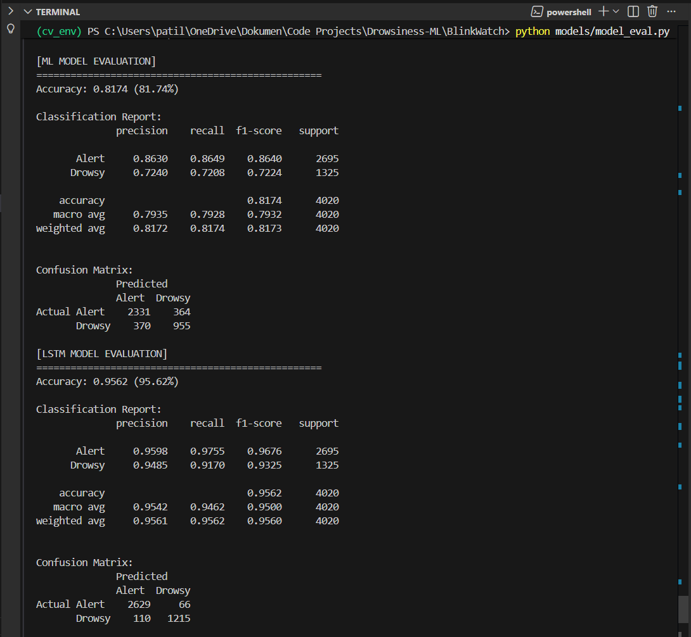
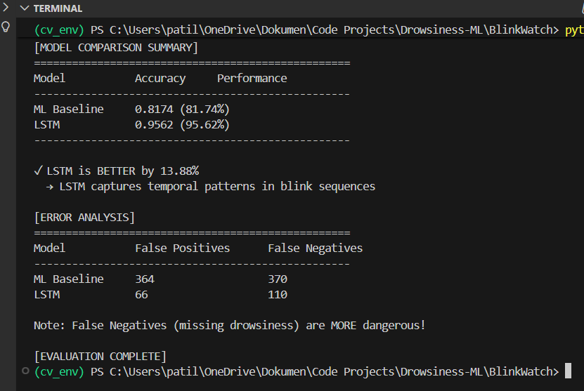

# BlinkWatch

### Project Description

BlinkWatch is a real-time drowsiness detection system that analyzes eye-blink behavior using MediaPipe FaceMesh, engineers blink-based features, classifies alert vs drowsy states with a Random Forest model, and captures temporal patterns using a TensorFlow LSTM network to trigger smart alarm warnings.


## 🔧 Tech Stack 

```
    Computer Vision: OpenCV-Python 4.10.0.84, MediaPipe FaceMesh 0.10.14

    ML / Deep Learning: Scikit-Learn (Random Forest), TensorFlow-CPU 2.16.1 (LSTM via Keras)

    Data Processing: NumPy 1.26.4, Pandas 2.2.2, Joblib 1.4.2

    Core Utilities: EAR (eye aspect ratio) calculations, Head pose estimation

    Environment & Package Management: Python venv, requirements.txt

    Frontend (Future Scope): Streamlit (UI only, not used in current pipeline)
```

## Images: 

Image1


Image2


Image3


Image4


Image5



## 🚀 Final Setup Instructions

1) Clone your repo
```
    git clone https://github.com/Shivp45/BlinkWatch.git  
    cd BlinkWatch
```

2) Create & activate virtual environment
```
    python -m venv cv_env  
    cv_env\Scripts\activate   # windows

    source cv_env/bin/activate    # Mac
```

3) Install dependencies
```
    pip install -r requirements.txt
```


4) Run data collection (if needed)
```
    python data_collection/record_blinks.py
```

5) Run feature extraction (If new feed was added)
```
    python feature_extraction/extract_features.py
```

6) Train ML baseline model (Random Forest)
```
    python models/train_ml.py
```

7) Train LSTM model (uses temporal 30-frame sequences stored in dataset/)
```
    python models/train_lstm.py
```

8) Evaluate model performance
```
    python models/model_eval.py
```

9) Run real-time drowsiness detection using webcam
```
    python inference/realtime_detect.py
```


Flow Diagram: 

┌──────────────────────┐
│  Start System        │
└──────────┬───────────┘
           ▼
┌──────────────────────┐
│  Open Webcam Feed    │
└──────────┬───────────┘
           ▼
┌────────────────────────────┐
│  Detect Face Landmarks     │
│  (MediaPipe Face Mesh)     │
└──────────┬─────────────────┘
           ▼
┌────────────────────────────┐
│  Extract EAR per Frame     │
│  (eye aspect ratio values) │
└──────────┬─────────────────┘
           ▼
┌────────────────────────────┐
│  Detect Blinks using EAR   │
│  Threshold + Timings       │
└──────────┬─────────────────┘
           ▼
┌────────────────────────────┐
│  Store Raw Blink Metrics   │
│  → features.csv created    │
└──────────┬─────────────────┘
           ▼
┌────────────────────────────┐
│  Run Feature Extraction    │
│  (clean + sequence build)  │
│  → X.npy, y.npy created    │
└──────────┬─────────────────┘
           ▼
┌────────────────────────────┐
│  Train ML Model            │
│  (Random Forest Classifier)│
│  → ml_model.pkl saved      │
└──────────┬─────────────────┘
           ▼
┌────────────────────────────┐
│  Train LSTM Temporal Model │
│  (TensorFlow Keras LSTM)   │
│  → lstm_model.keras saved  │
└──────────┬─────────────────┘
           ▼
┌────────────────────────────┐
│  Evaluate Both Models      │
│  → Accuracy comparison    │
└──────────┬─────────────────┘
           ▼
┌────────────────────────────┐
│  Load Trained Models       │
│  + Open Webcam Again       │
└──────────┬─────────────────┘
           ▼
┌────────────────────────────┐
│  Real-Time Prediction      │
│  (Alert / Drowsy status)   │
└──────────┬─────────────────┘
           ▼
┌────────────────────────────┐
│  Trigger Alarm if Drowsy   │
│  (audio alert system)      │
└──────────┬─────────────────┘
           ▼
┌──────────────────────┐
│  End / Stop System   │   Press esc
└──────────────────────┘

